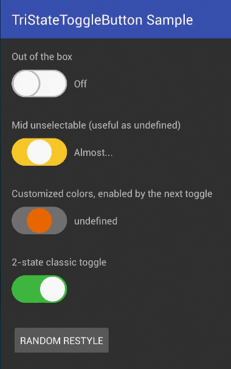

# TriState Toggle Button
A fully customizable and super-easy tri-state toggle button (switch button if you prefer) for Android, based on iOS look and feel.
Can act with three independent states, or with two states like a standard checkbox, or with two states plus one undefined.

 

* Out-of-the-box working 3-state toggle
* Fully customizable and styleable
* Can become a classic 2-state toggle returning booleans
* Can become a 2.5-state toggle: on/off and an unselectable mid button
* Can be enabled / disabled
* Can be programmatically controlled

 

### Setup (Gradle)
In your project's build.gradle file:

    allprojects {
        repositories {
            ...
            maven { url "https://jitpack.io" }
            ...
        }
    }
    
In your Application's or Module's build.gradle file:

    dependencies {
        ...
        compile 'com.github.BeppiMenozzi:TriStateToggleButton:1.0.3'
        ...
    }
    
### Setup (Eclipse)
Whaaaaat?

### Minimal usage
Layout:

    ...
    xmlns:app="http://schemas.android.com/apk/res-auto"
    ...
    <it.beppi.tristatetogglebutton_library.TriStateToggleButton
            android:layout_width="80dp"
            android:layout_height="40dp"
            android:id="@+id/tstb_1"
     />

Listener:

    ...
    TriStateToggleButton tstb_1 = (TriStateToggleButton) findViewById(R.id.tstb_1);
    tstb_1.setOnToggleChanged(new TriStateToggleButton.OnToggleChanged() {
            @Override
            public void onToggle(TriStateToggleButton.ToggleStatus toggleStatus, boolean booleanToggleStatus, int toggleIntValue) {
                switch (toggleStatus) {
                    case off: break;
                    case mid: break;
                    case on: break;
                }
            }
        });
    ...

Inside onToggle() you can use the ToggleStatus type values, or limit yourself to use booleans or integers (0, 1, 2) if you want it easy.

To have a two-states toggle button:

     <it.beppi.tristatetogglebutton_library.TriStateToggleButton
            android:layout_width="80dp"
            android:layout_height="40dp"
            android:id="@+id/tstb_1"
            app:tbIsMidSelectable="false"
     />

To have a two-states toggle button, with an undefined starting value:

     <it.beppi.tristatetogglebutton_library.TriStateToggleButton
            android:layout_width="80dp"
            android:layout_height="40dp"
            android:id="@+id/tstb_1"
            app:tbIsMidSelectable="false"
            app:tbDefaultStatus="mid"
     />
     
Browse the full example here:
<a href="https://github.com/BeppiMenozzi/TriStateToggleButton/tree/master/tristatetogglebutton_sample/src/main">Example</a>

### New in 1.0.3
* Toggle now can set and return integer values (0, 1, 2)
* Warning: onToggle() changed to include integer values
* Added static functions to convert from/to booleans and integers to/from toggleStatus

Credits
-------
This project is strongly based on (and contains parts of code of) the very beautiful <a href="https://github.com/zcweng/ToggleButton">Toggle Button by zcweng.</a>

Author
-------
* Beppi Menozzi

License
-------
    The MIT License (MIT)
    
    Copyright (c) 2014 Le Van Hoang
    
    Permission is hereby granted, free of charge, to any person obtaining a copy
    of this software and associated documentation files (the "Software"), to deal
    in the Software without restriction, including without limitation the rights
    to use, copy, modify, merge, publish, distribute, sublicense, and/or sell
    copies of the Software, and to permit persons to whom the Software is
    furnished to do so, subject to the following conditions:
    
    The above copyright notice and this permission notice shall be included in all
    copies or substantial portions of the Software.
    
    THE SOFTWARE IS PROVIDED "AS IS", WITHOUT WARRANTY OF ANY KIND, EXPRESS OR
    IMPLIED, INCLUDING BUT NOT LIMITED TO THE WARRANTIES OF MERCHANTABILITY,
    FITNESS FOR A PARTICULAR PURPOSE AND NONINFRINGEMENT. IN NO EVENT SHALL THE
    AUTHORS OR COPYRIGHT HOLDERS BE LIABLE FOR ANY CLAIM, DAMAGES OR OTHER
    LIABILITY, WHETHER IN AN ACTION OF CONTRACT, TORT OR OTHERWISE, ARISING FROM,
    OUT OF OR IN CONNECTION WITH THE SOFTWARE OR THE USE OR OTHER DEALINGS IN THE
    SOFTWARE.

